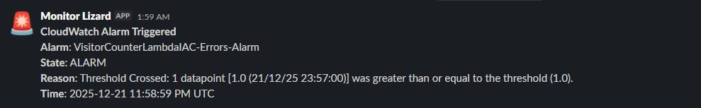

# Cloud Resume Project — AWS | DevOps | Security | Automation

This project is a **production-grade, cloud-native personal portfolio platform** demonstrating real-world skills in **AWS architecture, infrastructure as code, DevOps automation, security engineering, and monitoring**. It extends beyond a static resume with a fully automated, multi-account AWS environment, CI/CD pipelines, serverless backend services, and globally distributed content delivery.

### What This Project Solves
- **end-to-end cloud system design** instead of a simple frontend-only portfolio
- **automated infrastructure provisioning** using CloudFormation and GitHub Actions
- **secure, scalable backend services** with API Gateway, Lambda, and DynamoDB
- **real-world security practices** including IAM least privilege, encrypted secrets, TLS, DNSSEC, and CDN origin protection
- **monitoring and incident visibility** through CloudWatch alarms and Slack notifications

### Live Deployment
🌐 https://ivanovv.dev

### Credits & Inspiration
This project is guided by **_The Cloud Resume Challenge Guidebook (AWS Edition)_** by **Forrest Brazeal**, which provided the architectural foundation for its design, automation, and security practices.


## Architecture Overview

### System Diagram  


---

### Core Components

**CloudFront + S3 — Static Frontend**  
The frontend is hosted in an **Amazon S3 private bucket** and delivered globally through **Amazon CloudFront** using **Origin Access Control (OAC)**. This ensures content is only accessible via the CDN, providing low-latency performance, HTTPS enforcement, and protection against direct bucket access.

**API Gateway + Lambda — Serverless Backend**  
A **REST API** built with **Amazon API Gateway** exposes a secure endpoint for visitor tracking. Requests are processed by an **AWS Lambda function**, enabling a fully serverless, auto-scaling backend with no infrastructure management overhead.

**DynamoDB — Visitor Tracking Storage**  
Visitor data is stored in **Amazon DynamoDB**, using one table to maintain the global visitor counter and a second table to track hashed IP addresses. This design prevents duplicate counts while preserving visitor privacy.

**AWS Organizations + Identity Center — Multi-Account Governance**  
The environment is structured using **AWS Organizations** with separate management, production, and test accounts. **IAM Identity Center** provides centralized access control through permission sets and account assignments, enforcing least-privilege access across the organization.

**Cloudflare DNS + DNSSEC — Domain & Edge Security**  
**Cloudflare** acts as the domain registrar and authoritative DNS provider, with **DNSSEC enabled** to protect against DNS spoofing and tampering. A CNAME record routes traffic to the CloudFront distribution for secure global delivery.

**Monitoring + Slack Alerts — Observability & Incident Response**  
**Amazon CloudWatch** monitors backend health and performance. Alarms trigger **SNS notifications**, which invoke a Lambda function that delivers formatted alerts directly to **Slack**, enabling real-time visibility into system issues.

---

### Data Flow

User → CloudFront → S3 → API Gateway → Lambda → DynamoDB

#### Backend Health Check
Verify API availability directly:

```bash
curl -X POST https://<API_ID>.execute-api.<REGION>.amazonaws.com/<STAGE>/visitor
```

## Tech Stack

### Cloud & Infrastructure
- **AWS Organizations** — Multi-account environment (Management, Production, Test)
- **IAM Identity Center** — Centralized identity and access management
- **Amazon S3** — Static site hosting
- **Amazon CloudFront** — Global CDN with Origin Access Control (OAC)
- **AWS Certificate Manager (ACM)** — TLS certificates for HTTPS
- **Amazon API Gateway** — Serverless REST API
- **AWS Lambda** — Backend compute and alerting functions
- **Amazon DynamoDB** — Visitor counter and IP tracking storage
- **Amazon CloudWatch** — Metrics, logs, and alarms
- **AWS Systems Manager Parameter Store** — Encrypted secret management
- **AWS Key Management Service (KMS)** — Encryption for sensitive parameters

### DevOps & Automation
- **GitHub Actions** — CI/CD pipelines with OIDC-based AWS authentication
- **AWS CloudFormation** — Infrastructure as Code
- **Cypress** — End-to-end and API smoke testing
- **SHA256 Artifact Versioning** — Immutable Lambda deployment packages

### Frontend
- **HTML5, CSS3, JavaScript (ES Modules)** — Responsive static website
- **ScrollReveal.js** — UI animations

### DNS & Edge Security
- **Cloudflare** — Domain registrar and authoritative DNS
- **DNSSEC** — DNS integrity and spoofing protection
- **HTTPS (TLS)** — Enforced end-to-end encryption

## Repository Structure

This repository is organized to clearly separate **infrastructure, application code, automation pipelines, and testing**, following modern cloud engineering and DevOps best practices.
```
root/
├── .github/workflows/      # CI/CD pipelines (GitHub Actions)
├── infra/                 # Infrastructure as Code (CloudFormation)
│   ├── organization/     # AWS Organizations & account structure
│   ├── identity-center/  # IAM Identity Center & permission sets
│   ├── backend/          # API, Lambda, DynamoDB, IAM stacks
│   ├── monitoring/       # CloudWatch alarms & Slack integration
│   └── static-site/      # S3, CloudFront, TLS, CDN configuration
├── backend/lambdas/      # Serverless backend & alerting functions
│   ├── visitor_counter/
│   └── slack_notifier/
├── web/                  # Static frontend (HTML, CSS, JS, assets)
├── cypress/             # End-to-end and API smoke tests
├── package.json         # Test and frontend dependencies
└── README.md            # Project documentation
```

Each directory aligns with a specific responsibility, enabling **independent deployment, testing, and iteration** across infrastructure, backend services, and frontend content.

## CI/CD & Automation

This project adopts a "No Manual Changes" policy. All infrastructure and code changes are driven through **GitHub Actions**, ensuring a repeatable, audited, and hands-off deployment process.


### Pipeline Architecture
My automation is split into specialized workflows for granular control and safety:

* **Infrastructure-as-Code (IaC)**: 
    * **Org-Level**: Uses `deploy-organization.yml` to manage the AWS Organization structure via **OrgFormation**.
    * **App-Level**: `deploy-static-site.yml` and `deploy-identity-center.yml` provision specialized resources (OAC, IAM Permission Sets, etc.) using CloudFormation.
* **Backend Lifecycle**: The `deploy-backend.yml` pipeline performs:
    * **Artifact Versioning**: Generates unique hashes for Lambda deployment packages to ensure immutable releases.
    * **Atomic Updates**: Orchestrates stack updates and monitors for successful deployment signals before proceeding.
* **Frontend Sync**: `upload-static-site-content.yml` synchronizes assets to S3 and triggers an automated **CloudFront Cache Invalidation**, ensuring global users see updates instantly.

#### Manual Fallback (Local or Emergency Deploy)
If automated pipelines are unavailable, infrastructure can be deployed manually using CloudFormation:

```bash
aws cloudformation deploy \
  --stack-name backend-stack \
  --template-file infra/backend/backend-stack.yml \
  --capabilities CAPABILITY_NAMED_IAM \
  --parameter-overrides \
    ArtifactBucketName=<ARTIFACT_BUCKET> \
    ArtifactKey=<LAMBDA_ZIP_KEY>
```

### Quality Gates (Browser Up)
Before a deployment is promoted to production, the pipeline executes a dedicated **Testing Stage**:
* **Cypress E2E Tests**: Automated browser testing via `visitor-api.cy.js` to verify that the frontend UI and the Visitor Counter API are communicating correctly.
* **API Smoke Tests**: Validates that the REST API response codes (`200 OK`) and data structures meet requirements.
* **Failure Protection**: If any test fails, the deployment is automatically halted, protecting the live `ivanovv.dev` environment from regressions.

#### Run Tests Locally
Reproduce pipeline tests in a local development environment:

**Frontend Smoke Test**
```bash
npx cypress run --spec cypress/e2e/smoke.cy.js
```
**Backend API Test**
```bash
CYPRESS_API_URL=<API_URL> \
npx cypress run --spec cypress/e2e/visitor-api.cy.js
```

## Security & Governance

This project prioritizes a "Security-First" mindset, moving beyond default configurations to implement enterprise-grade hardening across three main layers: Identity, Infrastructure, and the Network Edge.

### Identity & Access Management
* **IAM Identity Center (SSO)**: Implemented AWS IAM Identity Center to manage a multi-account environment. Access is granted through centralized Permission Sets, eliminating the need for local IAM users in the production account. MFA is applied to every user.
* **Principle of Least Privilege (PoLP)**: Every execution role (Lambda, GitHub OIDC) is manually crafted to allow only the minimum required actions on specific resource ARNs. No `AdministratorAccess` is used for runtime services.
* **OIDC-Based Deployment**: GitHub Actions interacts with AWS using **OpenID Connect**, leveraging short-lived STS tokens instead of static, long-lived access keys.

### Edge & Network Security
* **DNSSEC Protection**: Configured **DNSSEC** via Cloudflare to cryptographically sign DNS records, protecting `ivanovv.dev` against DNS spoofing and man-in-the-middle cache poisoning.
* **Origin Access Control (OAC)**: The S3 bucket hosting the frontend is locked down with a Resource Policy that only allows traffic from the dedicated **CloudFront Service Principal**. This prevents users from bypassing the CDN to access the bucket directly.
* **TLS Encryption**: Enforced HTTPS using an **AWS Certificate Manager (ACM)** certificate. High-strength encryption is maintained throughout the transit path from the edge to the user.
* **API Hardening**: 
    * **CORS Management**: Strict Cross-Origin Resource Sharing (CORS) policies are enforced at the API Gateway to restrict requests only from authorized domains.
    * **Throttling**: Configured rate-limiting and burst-limits on API Gateway stages to protect the backend from brute-force attempts and denial-of-service (DoS).

### Secret Management & Data Protection
* **Encrypted Parameters**: Sensitive configuration values (such as Slack Webhooks) are stored in **AWS Systems Manager (SSM) Parameter Store**.
* **Hardware-Backed Security**: All sensitive parameters are encrypted at rest using **AWS Key Management Service (KMS)** with customer-managed keys (CMK), ensuring that secret data is never exposed in plaintext within code or logs.
* **Data Integrity**: To comply with privacy best practices, visitor IP addresses are never stored in plaintext. The backend utilizes **SHA-256 hashing** with a salt (stored in SSM) to anonymize user data before it reaches the database. This allows for unique visitor tracking without compromising individual privacy.

## Testing & Monitoring

A production-grade system is only as good as its visibility. This project implements a series of tests and a proactive monitoring pipeline to ensure 99.9% uptime and immediate incident response.

### Automated Quality Assurance
I utilize a "Shift-Left" testing approach where every code change is validated before it reaches the production environment.
* **End-to-End (E2E) Testing**: **Cypress** is integrated into the CI/CD pipeline to simulate real user journeys. The tests verify that the frontend correctly fetches and displays data from the AWS backend.
* **API Integration Testing**: Automated checks ensure the `visitor_counter` Lambda handles requests correctly, including edge cases like malformed JSON or unexpected payloads.
* **Idempotency Validation**: Specialized tests confirm the **IP Hashing** logic prevents double-counting the same user, ensuring data integrity.

### Proactive Monitoring
The infrastructure is equipped with a custom-built observability stack using **AWS CloudWatch** to detect and report issues in real-time.

| Alarm Type | Metric | Threshold | Purpose |
| :--- | :--- | :--- | :--- |
| **Availability** | `Errors` | Sum >= 1 | Detects code failures or runtime exceptions. |
| **Performance** | `Duration (p95)` | > 1000ms | Monitors latency to ensure a fast user experience. |
| **Anomaly** | `Invocations` | > 10 / 30s | Detects abnormal traffic spikes or potential DoS. |

#### Live Log Inspection
Investigate backend behavior in real time:

```bash
aws logs tail /aws/lambda/VisitorCounterLambdaIAC --follow
```

### Slack Incident Notifications
When an alarm threshold is breached, the following automated workflow occurs:
1.  **CloudWatch** triggers an **SNS Topic**.
2.  The `slack_notifier` Lambda function is invoked.
3.  The function parses the event and delivers a human-readable alert to a private **Slack** channel via Webhooks.

> **Example Incident Alert:**
> 

### Incident Response Workflow
1.  **Detection**: CloudWatch identifies a breach (e.g., p95 Latency > 1000ms).
2.  **Notification**: A formatted Slack alert is dispatched with the Error Message and Account ID.
3.  **Root Cause Analysis**: Using the alert details, logs are analyzed in **CloudWatch Logs** for rapid troubleshooting and resolution.


## Debugging & Troubleshooting Playbook

This section outlines a **systematic approach to incident response**, providing step-by-step procedures to diagnose and resolve issues across the frontend, backend, and infrastructure layers.

### 1️⃣ Verify Public Availability (Edge Layer)
**Symptom:** Site is unreachable or returning errors \
**Action:** Confirm CloudFront and DNS are serving content
```bash
curl -I https://ivanovv.dev
```
**Expected Result:** ```HTTP/2 200``` or ```HTTP/2 304```
If this fails, investigate Cloudflare DNS records, DNSSEC status, and CloudFront distribution health.

---
### 2️⃣ Validate API Health (Backend Entry Point)
**Symptom:** Visitor counter not updating or frontend API errors \
**Action:** Call the API Gateway endpoint directly
```bash
curl -X POST https://<API_ID>.execute-api.<REGION>.amazonaws.com/<STAGE>/visitor
```
**Expected Result:** ```200 OK``` with a JSON response containing the updated visitor count.

---
### 3️⃣ Inspect Lambda Execution
**Symptom:** API returns ```5XX``` or unexpected payloads \
**Action:** Tail backend logs in real time
```bash
aws logs tail /aws/lambda/VisitorCounterLambdaIAC --follow
```
Look for:
- Runtime exceptions
- Permission errors (`AccessDenied`)
- Timeout or cold start delays

---
### 4️⃣ Validate Database State
**Symptom:** Visitor count is stale or inconsistent \
**Action:** Query DynamoDB directly
```bash
aws dynamodb get-item \
  --table-name VisitorCounterIAC \
  --key '{"id": {"S": "visitor_count"}}'
```
Verify that the count value is incrementing and the item exists.

---
### 5️⃣ Check Infrastructure Template Integrity
**Symptom:** Stack creation or update fails unexpectedly \
**Action:** Validate CloudFormation templates locally
```bash
aws cloudformation validate-template \
  --template-body file://infra/backend/backend-stack.yml
```
Ensure the template passes syntax and structural validation before redeploying.

---
### 6️⃣ Check Deployment Events
**Symptom:** Recent changes caused service degradation \
**Action:** Inspect CloudFormation stack events
```bash
aws cloudformation describe-stack-events \
  --stack-name <STACK_NAME> \
  --query "StackEvents[?ResourceStatus=='CREATE_FAILED' || ResourceStatus=='ROLLBACK_IN_PROGRESS'].[LogicalResourceId,ResourceStatusReason]" \
  --output table
```

---
### 7️⃣ Confirm Edge Content Freshness
**Symptom:** Frontend changes not visible globally \
**Action:** Invalidate CloudFront cache
```bash
aws cloudfront create-invalidation \
  --distribution-id <DISTRIBUTION_ID> \
  --paths "/*"
```